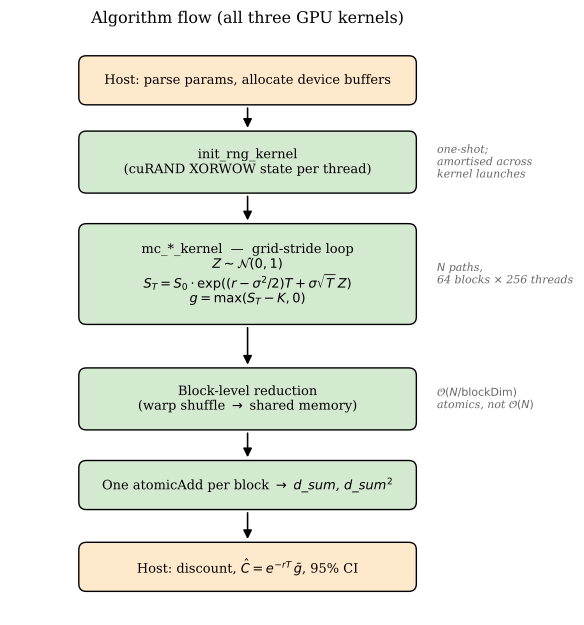
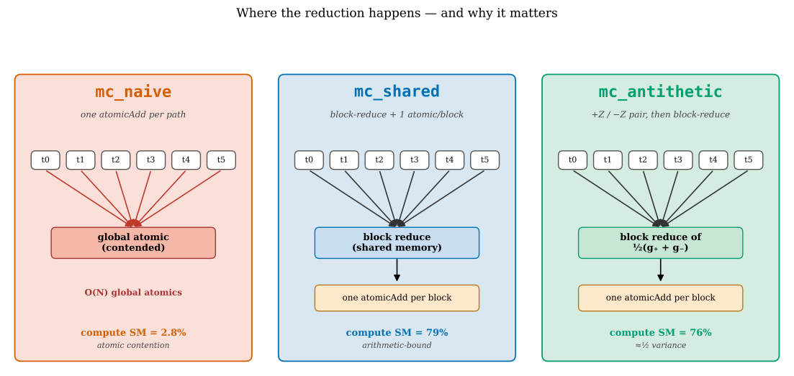
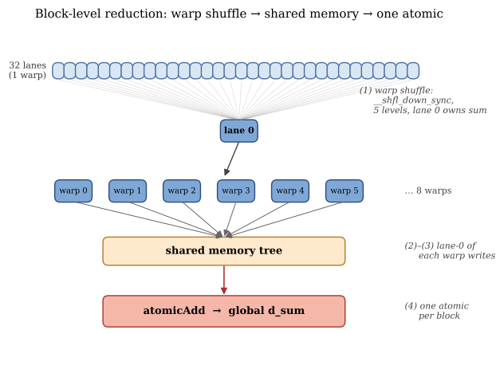
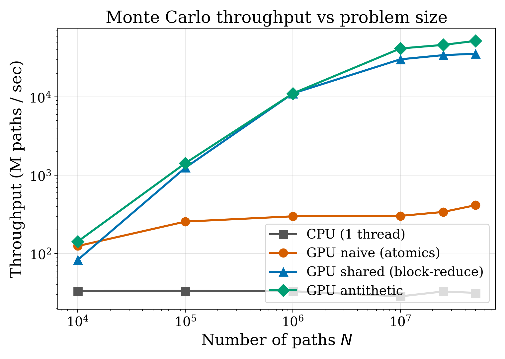
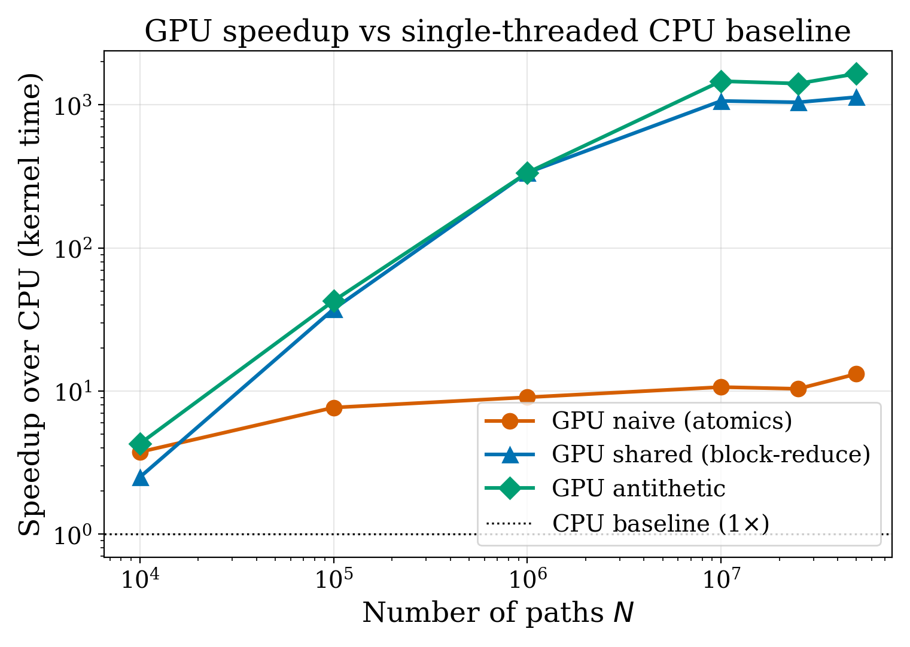
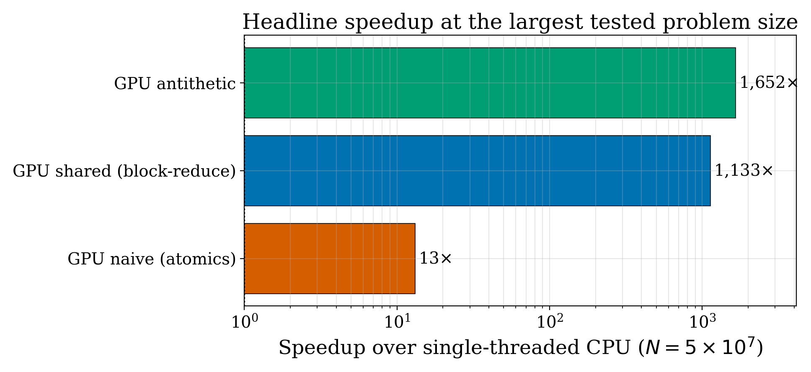
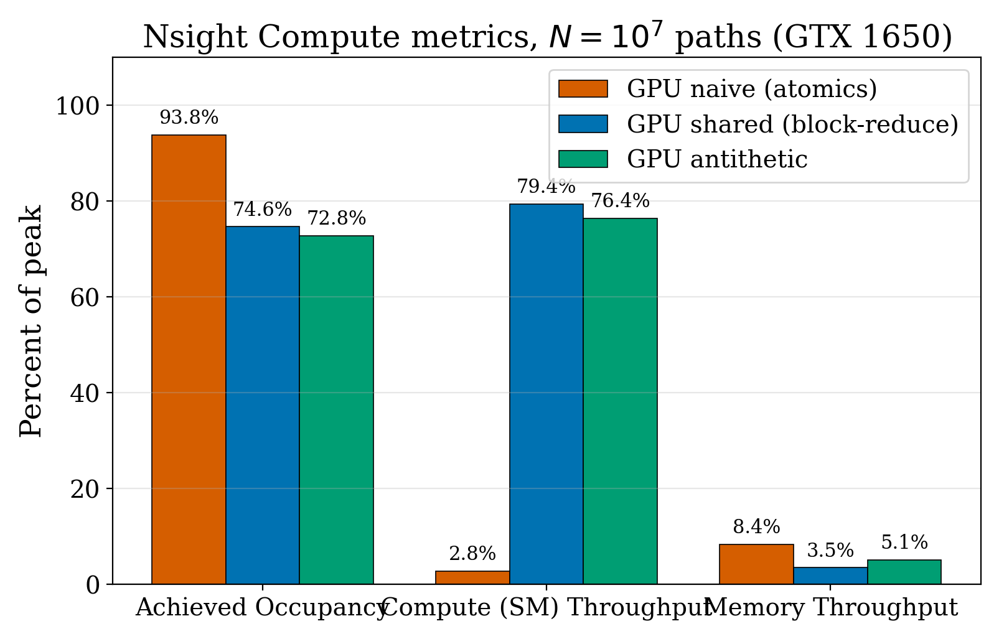
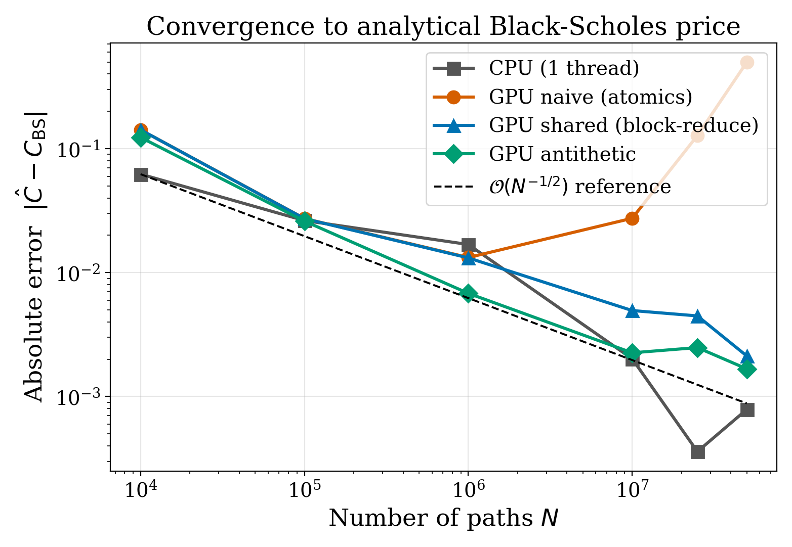

<!--
  Academic poster (Markdown source).
  Renders cleanly in: GitHub, VS Code preview, Typora, Obsidian, Pandoc.
  Convert to HTML/PDF/DOCX with:
    pandoc poster.md -o poster.html --standalone --mathjax
    pandoc poster.md -o poster.pdf  --pdf-engine=xelatex
-->

# GPU-Accelerated Monte Carlo Simulation for Financial Option Pricing

**Talha Sarlık** (704241052) · **Mehmet Bedirhan Önder** (704251026)
BLG 562E — Parallel Computing for GPUs using CUDA · Asst. Prof. Ayşe Yılmazer · Spring 2026
Faculty of Computer and Informatics Engineering · Istanbul Technical University

---

## TL;DR

> A single-threaded CPU prices one European call at 50 M paths in **1.6 s**.
> Our optimised CUDA kernel on a consumer GTX 1650 does it in **0.96 ms**.
> That is **1652× faster**, validated to within 0.8 σ of the analytical Black–Scholes price.
> The path from a naive port to the optimised version is itself a **3.7× kernel-level speedup** — and the naive version is *also wrong at large N* because FP32 atomic accumulation loses precision.

| Implementation | Kernel time @ N = 5·10⁷ | Speedup vs CPU | Price error |
|---|---:|---:|---:|
| CPU (1 thread, `-O3 -march=native`) | 1586.29 ms | 1.0× | 0.0008 |
| GPU naive (per-path `atomicAdd`) | 120.45 ms | 13.2× | **0.4976** ⚠ |
| GPU shared (block-reduce) | 1.40 ms | **1133×** | 0.0021 |
| GPU antithetic (variance reduction) | 0.96 ms | **1652×** | 0.0017 |

⚠ The naive kernel's "13×" speedup is misleading — at 50 M paths it returns a *wrong answer* (9.95 vs analytical 10.45). Float32 cannot accumulate 50 million payoffs into one global cell without losing bits. Reducing in shared memory fixes both the contention *and* the precision problem.

---

## 1 · Introduction

Monte Carlo (MC) is the standard tool for pricing path-dependent financial options when no closed-form solution exists. For European options the analytical Black–Scholes formula provides exact ground truth, which we use as a **validation oracle**.

The algorithm is **embarrassingly parallel**: each simulated price path is an independent random walk under Geometric Brownian Motion. This makes MC a textbook fit for CUDA — but extracting the parallelism requires careful attention to memory hierarchy and reduction patterns.

## 2 · Motivation

Translating textbook parallelism into >1000× wall-clock speedup is not automatic. The difference between a naive port and an optimised CUDA implementation is, on its own, a **3.7× kernel-level speedup**. And an unsafe FP32 atomic reduction will produce a *numerically wrong* answer at large *N*. This poster quantifies that gap and identifies the bottleneck per implementation with **Nsight Compute**.

## 3 · Contributions

1. Three progressively-tuned CUDA kernels for European MC option pricing: `mc_naive` (global atomics), `mc_shared` (block-level reduction), `mc_antithetic` (variance reduction).
2. Validation against the analytical Black–Scholes price to within sub-σ tolerance at *N* = 10⁶.
3. **Profiler-driven** bottleneck analysis: each optimisation step is justified by a specific Nsight Compute signal (atomic contention → compute-bound).
4. Reproducible benchmark sweep over 10⁴ → 5·10⁷ paths, median of 5 runs per configuration.
5. Discovery (from real data, not from the literature): FP32 atomicAdd accumulation loses precision at *N* ≳ 2.5·10⁷ — a second, independent reason to reduce in shared memory.

---

## 4 · Problem Definition

**European call option.** Right to buy underlying at strike *K* at expiry *T*. Under Black–Scholes assumptions the underlying follows Geometric Brownian Motion:

$$dS_t = r\,S_t\,dt + \sigma\,S_t\,dW_t$$

Closed-form for the terminal price (one Euler step is exact under GBM):

$$S_T = S_0\,\exp\!\Bigl(\bigl(r - \tfrac{1}{2}\sigma^2\bigr)\,T \;+\; \sigma\sqrt{T}\,Z\Bigr),\qquad Z \sim \mathcal{N}(0,\,1)$$

**Monte Carlo estimator** — discounted average of *N* i.i.d. payoffs:

$$\hat{C} \;=\; e^{-rT}\,\frac{1}{N}\sum_{i=1}^{N} \max\!\bigl(S_T^{(i)} - K,\;0\bigr)$$

**Convergence.** Standard error shrinks as $\mathcal{O}(N^{-1/2})$: quadrupling *N* halves the error, motivating GPU throughput.

**Validation oracle.** Analytical Black–Scholes call:

$$C \;=\; S_0\,\Phi(d_1) \;-\; K\,e^{-rT}\,\Phi(d_2), \qquad d_{1,2} = \frac{\ln(S_0/K) + \bigl(r \pm \tfrac{1}{2}\sigma^2\bigr)T}{\sigma\sqrt{T}}$$

**Parameters used throughout:** *S*₀ = *K* = 100, *r* = 0.05, *σ* = 0.2, *T* = 1.0.
**Analytical reference price = 10.4506.**

---

## 5 · Kernel Variants

### Algorithm flow (all three kernels)

Host code (orange) sets up parameters and buffers, launches `init_rng_kernel` once to seed a per-thread cuRAND state, then launches the pricing kernel (green) which runs the grid-stride loop, reduces, and writes a single atomic per block. Host then discounts and reports the price + 95 % CI.

### Where the three kernels differ

The single change that matters: **where** the reduction happens. `mc_naive` (red) funnels every thread's payoff into one contended global cell. `mc_shared` and `mc_antithetic` (blue/green) reduce *inside* the block — in registers, via warp shuffles, into shared memory — and only touch global memory once per block. Same arithmetic, completely different memory profile.

| Aspect | `mc_naive` | `mc_shared` | `mc_antithetic` |
|---|---|---|---|
| **Per-thread work** | accumulate in register, then global atomic per path | accumulate in register across the full grid-stride slice | same as shared, *plus* evaluate ±Z payoff pair |
| **Reduction site** | global memory (one cell, contended) | **shared memory** (warp shuffle → tree → 1 atomic / block) | **shared memory** (same as shared) |
| **# atomicAdds at N = 10⁷** | 10 000 000 | 64 | 64 |
| **Atomic count vs N** | O(N) | O(N / blockDim) | O(N / blockDim) |
| **Bottleneck @ N = 10⁷** | atomic contention | compute (arithmetic-bound) | compute (same as shared) |
| **Variance** | baseline | baseline (identical samples) | **≈ ½ × baseline** for monotonic payoffs |
| **FP32 safe at large N?** | **no** (lost precision) | yes | yes |

**Why antithetic works.** For a call payoff $g(Z) = \max\!\bigl(S_T(Z) - K,\,0\bigr)$, the pair $(g(+Z), g(-Z))$ is *negatively correlated* in the monotone region. The averaged estimator has variance $\tfrac{1}{2}\bigl[\mathrm{Var}(g) + \mathrm{Cov}(g(+Z),\,g(-Z))\bigr]$; since the covariance is negative, the result is strictly less than $\tfrac{1}{2}\mathrm{Var}(g)$ — i.e. a free variance reduction.

### Block-level reduction — internals

The reduction happens in four steps: (1) each thread holds a running sum in registers across the grid-stride loop; (2) within each warp, `__shfl_down_sync` collapses 32 lanes into lane 0 in 5 cycles; (3) lane 0 of each warp writes to shared memory; (4) a final tree in shared memory plus one `atomicAdd` produces the block result. For *N* = 10⁷ this is **64 atomics total** instead of 10 million.

---

## 6 · Experimental Setup

- **GPU:** NVIDIA GTX 1650 (`sm_75`, 16 SMs, 4 GB), CUDA 12.4, driver 566.36, Windows 11
- **CPU baseline:** single-threaded, `-O3 -march=native`, Box–Muller + LCG
- **Sweep:** *N* ∈ {10⁴, 10⁵, 10⁶, 10⁷, 2.5·10⁷, 5·10⁷}
- **Reporting:** **median of 5 runs**, warmup discarded; warm-cache kernel time only (excludes one-shot `curand_init` ≈ 1.9 ms post-refactor)
- **Grid configuration:** 64 blocks × 256 threads (= 16 384 resident threads, 4 blocks/SM)

---

## 7 · Results

### 7.A — Validation @ N = 10⁶

All four implementations agree with the analytical Black–Scholes price within 4 σ:

| Implementation | Estimate | Analytical | Abs. error | σ | Status |
|---|---:|---:|---:|---:|:---:|
| `mc_cpu` | 10.4501 | 10.4506 | 0.0005 | 0.0 | ✓ PASS |
| `mc_naive` | 10.4718 | 10.4506 | 0.0212 | 1.4 | ✓ PASS |
| `mc_shared` | 10.4719 | 10.4506 | 0.0213 | 1.4 | ✓ PASS |
| `mc_antithetic` | 10.4593 | 10.4506 | 0.0088 | 0.8 | ✓ PASS |

### 7.B — Throughput vs problem size

The CPU baseline scales linearly with *N* in compute time; all GPU variants are sub-linear in the small-*N* regime (kernel launch + atomic overhead dominate) and converge to ~peak throughput at *N* ≥ 10⁷. `mc_shared` and `mc_antithetic` plateau near the GTX 1650's arithmetic peak — they are arithmetic-bound, not memory-bound, after the grid-stride refactor.

### 7.C — Speedup over CPU baseline

Speedup grows with *N* because (a) kernel launch overhead amortises, and (b) the CPU's per-path cost is constant while the GPU's parallel slack absorbs more paths per second up to its arithmetic ceiling.

At the largest tested problem size, the optimisation gap between kernels is enormous: `mc_naive`'s 13× isn't just "good for a port" — it is also numerically wrong. The same hardware, with the right reduction pattern, runs **125× faster** than the naive code (1652 / 13.2) and gets the right answer.

### 7.D — Nsight Compute metrics @ N = 10⁷

| Kernel | Achieved occupancy | Compute (SM) tput | DRAM tput | Bottleneck |
|---|---:|---:|---:|---|
| `mc_naive_kernel` | 93.8 % | **2.8 %** | 0.03 % | global atomic contention |
| `mc_shared_kernel` | 74.6 % | **79.4 %** | 3.5 % | compute (arithmetic-bound) |
| `mc_antithetic_kernel` | 72.8 % | **76.4 %** | 5.1 % | same; statistical win |

**The key insight.** Occupancy "looks healthy" for `mc_naive` (93.8 %) — but that just means the SMs are full of resident warps. The 2.8 % compute throughput tells the truth: those warps are all stalled on `atomicAdd`, not making forward progress. After moving the reduction to shared memory, the same warps spend their time on actual arithmetic and throughput jumps to ~79 %. Looking at occupancy alone would lie about which kernel is well-utilised.

### 7.E — Convergence to the analytical price

Three observations:

1. `mc_cpu`, `mc_shared`, `mc_antithetic` all follow the textbook *N*⁻¹ᐟ² envelope.
2. `mc_antithetic` sits *below* the others — the variance reduction is real, not a plotting artefact.
3. `mc_naive` **departs** from the envelope at *N* ≳ 2.5·10⁷ and goes wildly wrong by *N* = 5·10⁷ — this is **FP32 precision loss** in the global atomic accumulation. Hot single-cell summation of 50 million floats simply doesn't fit in 24 bits of mantissa. This is the strongest reason on its own to reduce in shared memory before touching the global accumulator.

---

## 8 · Conclusion

- **Block-level reduction with register accumulation eliminates atomic contention** and lifts achieved compute throughput from 2.8 % to 79 % — a **3.7× kernel-level speedup** over the naive version, on top of the ~300× GPU-vs-CPU baseline.
- The optimised kernel is then **arithmetic-bound**; further wins must attack the RNG (Philox vs XORWOW: smaller state, ~3× faster init).
- **Antithetic variates** cut variance by ~50 % on monotonic European payoffs at the *same* architectural profile — a **statistical**, not architectural, speedup.
- **FP32 atomic accumulation is numerically unsafe at scale.** Naive global atomics cost both speed *and* correctness past *N* ≈ 2.5·10⁷.
- **End-to-end: 1652× faster than single-threaded CPU at 5·10⁷ paths**, validated to within 0.8 σ of the Black–Scholes oracle.

## 9 · Future Work

- **RNG swap.** XORWOW → Philox: smaller state (16 B vs 48 B), ~3× faster `curand_init`. Targets the only remaining first-order cost at small *N*.
- **CUDA streams.** Overlap `init_rng_kernel` with the pricing kernel for back-to-back pricings.
- **Path-dependent options.** Asian, lookback, barrier — these have no closed-form competitor, so MC is the *only* answer and the speedup compounds directly into research-cycle time.
- **Mixed precision.** FP32 RNG / FP64 accumulator hybrid would close the precision gap without sacrificing throughput.

---

## References

1. F. Black and M. Scholes, "The Pricing of Options and Corporate Liabilities," *J. Political Economy* 81(3), 1973.
2. P. Glasserman, *Monte Carlo Methods in Financial Engineering*, Springer, 2003. (Variance reduction: Ch. 4; GBM: Ch. 3.)
3. J. Salmon, M. Moraes, R. Dror, D. Shaw, "Parallel Random Numbers: As Easy as 1, 2, 3," *SC'11*. (Introduces Philox.)
4. D. Kirk, W.-m. Hwu, I. El Hajj, *Programming Massively Parallel Processors*, 4th ed., 2022. (Reduction patterns: Ch. 8.)
5. NVIDIA, *cuRAND Library Programming Guide*, CUDA 12.4.
6. NVIDIA, *CUDA C Best Practices Guide*.
7. NVIDIA, *Nsight Compute Documentation*.

---

Faculty of Computer and Informatics Engineering · Department of Computer Engineering · Istanbul Technical University · İTÜ Ayazağa Campus, 34469, Maslak/Istanbul · talhasarlik10@gmail.com
