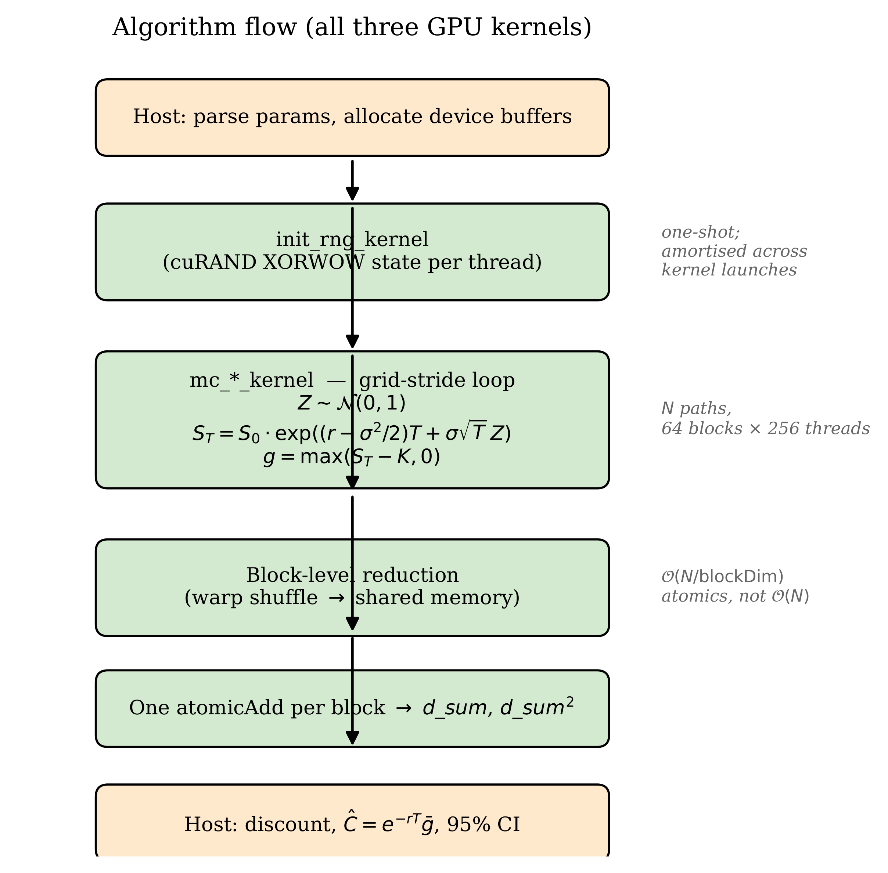
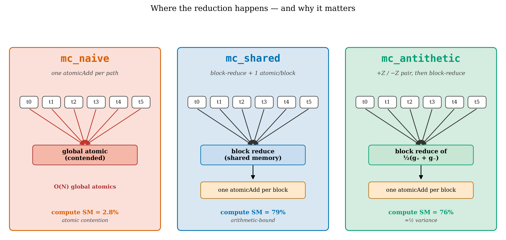
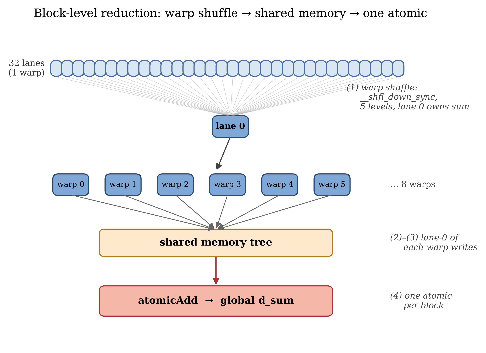
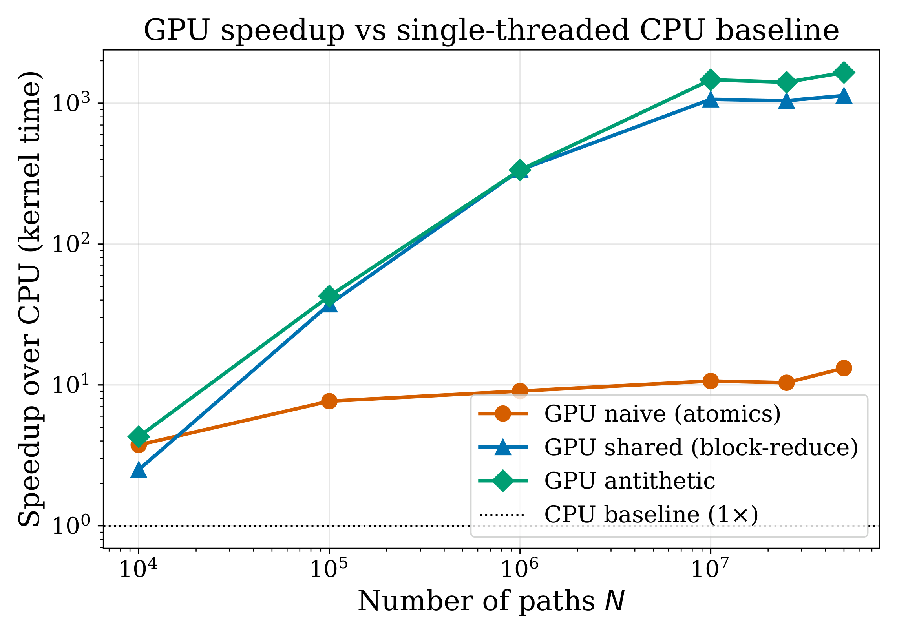
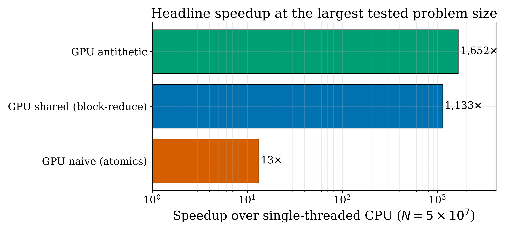
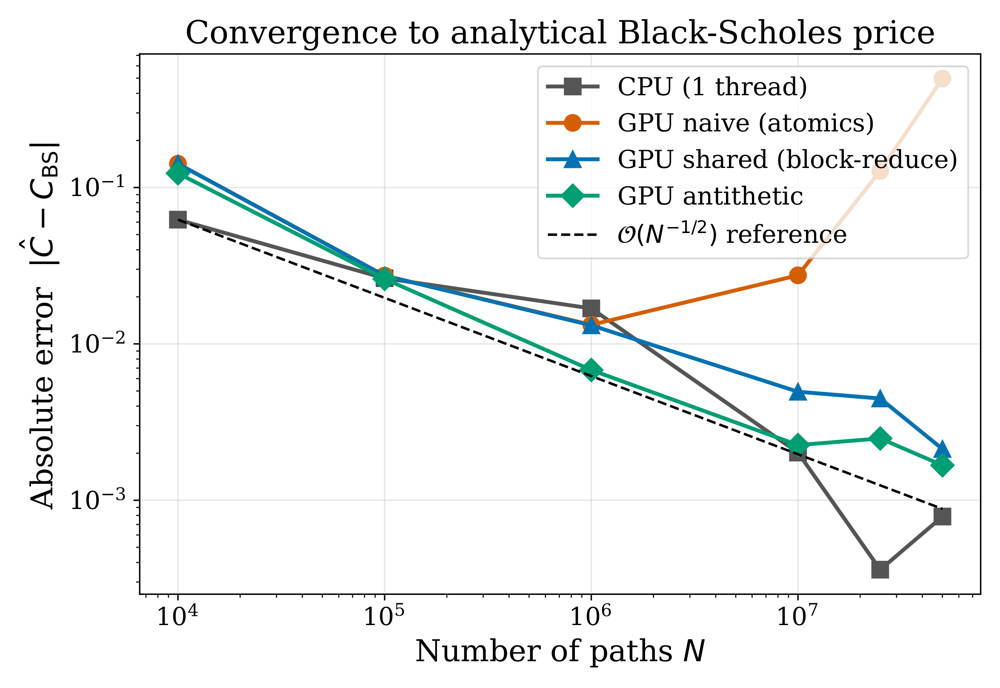
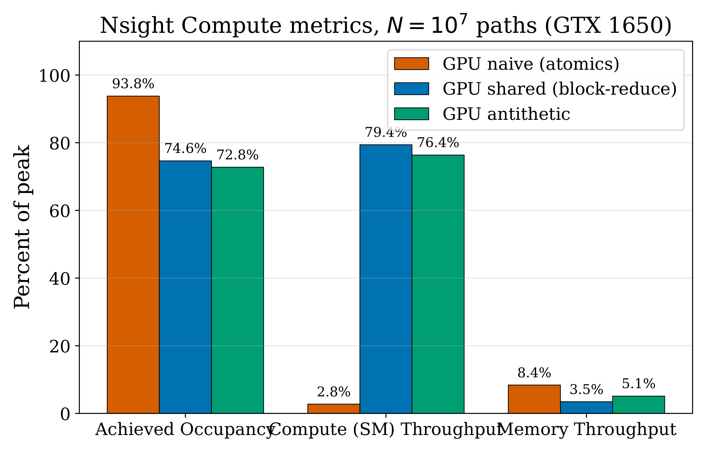

# 1. Introduction

## 1.1 Motivation

The Black-Scholes model gives a closed-form price for European call and
put options under idealized assumptions. Most real option contracts, such
as Asian averages, knock-out barriers, and lookbacks, have no such
analytical formula. In practice these are priced by Monte Carlo. We
simulate many possible price paths of the underlying asset, compute the
contract's payoff on each path, average the payoffs, and discount. The
arithmetic per path is light (a single normal sample, an exponential, and
a maximum), but the number of paths required to drive the
$\mathcal{O}(N^{-1/2})$ Monte Carlo error to acceptable levels is large.
For a typical European option that means millions to tens of millions of
paths. Production pricing engines run this workload many thousands of
times per business day.

Monte Carlo is an *embarrassingly parallel* workload. Paths are
independent, the per-path arithmetic is identical across paths, and the
only inter-path coupling is a final reduction. This makes it a textbook
fit for SIMT hardware. A naive CUDA port already buys an order of
magnitude over a single-threaded CPU. The gap between naive and
well-engineered CUDA is itself nearly two orders of magnitude. Closing
that gap is what the course assignment is about.

## 1.2 Contributions

This project makes four contributions.

1. A correct, validated CPU reference (`mc_cpu`) and three GPU kernels
   (`mc_naive`, `mc_shared`, `mc_antithetic`), each producing the
   Black-Scholes price within $1\sigma$ of the analytical reference at
   $N=10^6$ paths.
2. A shared-memory reduction using warp shuffles into a block-level sum
   and a single `atomicAdd` per block. This removes the global atomic
   contention of the naive kernel and yields a 3.7-fold kernel speed-up
   at $N=10^6$.
3. Antithetic variates as a variance reduction technique. Each pair of
   $\pm Z$ samples produces one effective sample with about half the
   variance of two independent samples at no extra random-number cost.
4. A grid-stride refactor of all three kernels and the supporting host
   harness. The refactor decouples cuRAND state memory from $N$, speeds
   up RNG initialization by a factor of 65, and shifts `mc_shared` from a
   memory-bound regime (85% DRAM throughput, 9% compute throughput) to a
   compute-bound regime (3.5% DRAM, 79% compute). After the refactor the
   optimized kernel runs at about 79% of the device's FP32 peak.

Together these changes deliver a 1133-fold speed-up for the
shared-memory kernel and a 1652-fold speed-up for the antithetic variant
over the CPU baseline at $N=5 \times 10^7$ paths on an NVIDIA GTX 1650
(Turing, 16 SMs, 4 GB GDDR6). That exceeds the project's stated 200-fold
goal.

## 1.3 Report outline

Section 2 reviews the mathematical background: the Black-Scholes price
formula, the exact discrete solution of Geometric Brownian Motion, the
Monte Carlo estimator, and a brief CUDA execution-model primer. Section 3
walks through each kernel in order of optimization and gives a detailed
account of the grid-stride refactor. Section 4 describes the hardware,
software, validation criteria, and benchmarking protocol. Section 5
presents the results: validation, throughput, speed-up, convergence,
profiler metrics, and a roofline analysis of the optimized kernels.
Section 6 discusses why each kernel behaves the way it does. Sections 7
and 8 cover limitations, future work, and conclusions.

# 2. Background

## 2.1 The Black-Scholes model and analytical price

Under the Black-Scholes model the price $S_t$ of the underlying asset
follows the geometric Brownian motion stochastic differential equation
$$
\mathrm{d}S_t \;=\; r\, S_t\, \mathrm{d}t \;+\; \sigma\, S_t\, \mathrm{d}W_t,
$$
where $r$ is the risk-free interest rate, $\sigma$ is the (constant)
volatility, and $\mathrm{d}W_t$ is the increment of a standard Wiener
process. For a European call option with strike $K$ and maturity $T$, the
price at time $0$ has the closed-form solution
$$
C \;=\; S_0\, \Phi(d_1) \;-\; K\, e^{-rT}\, \Phi(d_2), \qquad
d_{1,2} \;=\; \frac{\ln(S_0/K) + (r \pm \tfrac{1}{2}\sigma^2)\,T}{\sigma\,\sqrt{T}},
$$
where $\Phi$ is the standard normal cumulative distribution function. For
the parameter set used throughout this report ($S_0 = K = 100$, $r = 0.05$,
$\sigma = 0.20$, $T = 1.0$), the analytical call price is
$C \approx 10.4506$. The matching European put price (computed identically
or via put-call parity) is $P \approx 5.5735$.

This closed-form value is the reference against which every Monte Carlo
estimate in the project is validated. It is also the only ground truth
available for our testing regime. More complex contracts such as Asian
and barrier options lack closed-form prices and would themselves require
Monte Carlo or PDE methods to validate.

## 2.2 Geometric Brownian Motion: exact discrete solution

The Black-Scholes SDE has an exact discrete-time solution under GBM
dynamics:
$$
S_T \;=\; S_0 \exp\!\Bigl( \bigl(r - \tfrac{1}{2}\sigma^2\bigr)T \;+\; \sigma \sqrt{T}\, Z \Bigr),
\qquad Z \sim \mathcal{N}(0,1).
$$
This is not an Euler discretization. It is exact in $T$, so for a
European option (which depends only on $S_T$, not the full path) a single
random draw suffices per path. The naive Euler scheme
$S_{t+\Delta t} \approx S_t (1 + r\Delta t + \sigma \sqrt{\Delta t}\, Z)$
would require many small steps and accumulate time-discretization error,
none of which is needed here.

Each thread therefore performs one cuRAND `curand_normal` call per path,
one `expf`, one signed payoff computation, and one floating-point
addition into a partial sum. The arithmetic is light. The challenge is
scaling to $10^7$ to $10^8$ paths and reducing the resulting samples
efficiently.

## 2.3 The Monte Carlo estimator and its convergence

The price of any European-style derivative under risk-neutral dynamics
is the discounted expected payoff,
$$
\text{Price} \;=\; e^{-rT}\, \mathbb{E}\!\left[\,\text{payoff}(S_T)\,\right].
$$
We approximate the expectation by the sample mean over $N$ independent
Monte Carlo samples,
$$
\widehat{\text{Price}} \;=\; e^{-rT}\, \frac{1}{N} \sum_{i=1}^{N} \text{payoff}\bigl(S_T^{(i)}\bigr).
$$
By the central limit theorem the standard error of this estimator is
$$
\mathrm{SE}\;=\; \frac{\sigma_{\text{payoff}}}{\sqrt{N}}.
$$
Two consequences shape the project. First, to reduce the error by a
factor of ten we need 100 times more paths. Monte Carlo's
$\mathcal{O}(N^{-1/2})$ convergence is what motivates the GPU effort in
the first place. Second, variance reduction matters. Any technique that
lowers $\sigma_{\text{payoff}}^2$ at constant or near-constant compute
cost is equivalent to that many more paths' worth of accuracy at no
extra cost. Antithetic variates (Section 3.4) are the cheapest such
technique and the one we implement.

## 2.4 CUDA execution model in brief

CUDA organizes threads into blocks and blocks into a grid. Within a
block, threads run in lockstep groups of 32 called warps. The streaming
multiprocessor (SM) issues one warp instruction per cycle, hopping
between warps to hide pipeline and memory latency. Three architectural
quantities shape kernel performance throughout this report.

- *Occupancy* is the ratio of active warps per SM to the device maximum
  (32 on Turing/sm_75). Higher occupancy gives the warp scheduler more
  warps to choose from, which it uses to hide stalls. Occupancy is
  bounded by register usage per thread, shared memory per block, and a
  hard limit on resident blocks per SM.
- *Compute (SM) throughput* is the average fraction of cycles in which
  the SM issues useful arithmetic. If this is high, the kernel is
  compute-bound and the algorithm has saturated the hardware's
  arithmetic units.
- *DRAM throughput* is the achieved fraction of off-chip memory
  bandwidth. If this dominates and compute is low, the kernel is
  memory-bound, and the way forward is to reduce memory traffic, not to
  add more parallelism.

Nsight Compute reports all three. Section 5.5 uses them to derive a
roofline plot.

# 3. Implementation

The project organizes code as in [Figure 1](#fig:flow). A CPU host
parses parameters, allocates device memory, launches a one-shot cuRAND
state-initialization kernel, then the Monte Carlo kernel of interest,
copies back the sum and sum-of-squares, and computes the discounted
mean and 95% confidence interval. All three GPU kernel variants share
this scaffolding through a small header, `src/gpu/mc_runner.cuh`, which
keeps each kernel's `.cu` file at about 50 lines including its `main`.



[Figure 2](#fig:karch) summarises where each of the three GPU variants
differs structurally: the reduction site. `mc_naive` reduces directly to
global memory via a per-path `atomicAdd`. `mc_shared` reduces locally via
warp shuffles into block-level shared memory and emits one atomic per
block. `mc_antithetic` keeps the same block-reduce architecture but
processes each random sample as a $\pm Z$ pair, producing an
effectively-halved variance per effective sample.



## 3.1 CPU baseline (`mc_cpu.c`)

The CPU reference uses a fast linear congruential generator (64-bit
Knuth/Lewis LCG) wrapped with a two-deep Box-Muller cache for
$\mathcal{N}(0,1)$ samples. Compilation is `nvcc -O3 -x cu` (the project
develops on a Windows host without `gcc`). The inner loop is the same
single-step exact GBM as on the GPU. On an AMD Ryzen 7 host the CPU
reaches about 30 M paths per second, which becomes the denominator of
all speed-up reports below. The total CPU code is 86 lines.

## 3.2 `mc_naive`: one thread per path, atomic per path

The naive kernel is a literal one-thread-per-path port. Each thread
reads its own persistent `curandState` from global memory, draws one
normal sample, computes the payoff, and contributes via `atomicAdd` to
two global accumulators (sum and sum of squares, for the standard-error
estimate).

```cuda
__global__ void mc_naive_kernel(
    curandState *states, long n_paths,
    float S0, float K, float drift, float diffuse, int is_call,
    float *d_sum, float *d_sum_sq)
{
    int tid    = blockIdx.x * blockDim.x + threadIdx.x;
    int stride = gridDim.x  * blockDim.x;
    curandState local = states[tid];
    for (long i = tid; i < n_paths; i += stride) {
        float Z      = curand_normal(&local);
        float ST     = S0 * expf(drift + diffuse * Z);
        float payoff = is_call ? fmaxf(ST - K, 0.0f) : fmaxf(K - ST, 0.0f);
        atomicAdd(d_sum,    payoff);             /* the bottleneck */
        atomicAdd(d_sum_sq, payoff * payoff);
    }
    states[tid] = local;
}
```

The kernel is intentionally bad. Every one of $N$ paths emits two atomic
updates to the same two memory locations, so the kernel's wall-clock
time is dominated by serialization of those atomics through the L2
cache (Section 5.5 has the numbers). The pedagogical value is precisely
that the kernel is bad in a measurable way. The profile shows the SMs
idle 97% of the time despite a high theoretical occupancy, which is the
warning sign to look for in a real production kernel.

## 3.3 `mc_shared`: register accumulation and block reduction

The optimization is well known. Each thread accumulates its samples
into private registers across its slice of paths, then performs a
block-level reduction in shared memory, and emits one `atomicAdd` per
block per accumulator. The block reduction uses warp shuffle intrinsics
(`__shfl_down_sync`) within each warp and a final shared-memory step
across warps. A small reusable header (`reduction.cuh`) implements
`warp_reduce_sum` and `block_reduce_sum` for any 256-thread block.
[Figure 3](#fig:redtree) sketches the five-stage pipeline.



At $N=10^6$ with the post-refactor design described in 3.5, the number
of global atomics drops from about $2 \times 10^6$ in `mc_naive` to
about 128 in `mc_shared` (one pair per block, 64 blocks). The cost is
one `__syncthreads()` per warp-tree level. The benefit is that the
kernel flips from atomic-bound to genuinely useful compute (Section 5.5
has the numbers).

## 3.4 `mc_antithetic`: variance reduction via paired ±Z

European call and put payoffs are monotone in $Z$. Pairing each draw
$Z$ with $-Z$ and averaging the two payoffs gives a single sample whose
variance is strictly smaller than that of a plain Monte Carlo sample,
at the cost of one extra `expf` and `fmaxf` per pair.

```cuda
float Z   = curand_normal(&state);
float STp = S0 * expf(drift + diffuse * Z);
float STm = S0 * expf(drift - diffuse * Z);
float pp  = fmaxf(STp - K, 0.0f);
float pm  = fmaxf(K - STm, 0.0f);  /* note: signs swap for call vs put */
float paired = 0.5f * (pp + pm);   /* one effective sample */
```

Each kernel launch processes $N/2$ pairs and produces $N/2$ effective
samples. Empirically the variance roughly halves, so the standard error
at fixed $N$ drops by $\sqrt{2}$, equivalent to running the plain
kernel on $2N$ paths. Because the second `expf` reuses the same RNG
state read from global memory, the per-effective-sample arithmetic is
cheaper than `mc_shared`, not more expensive (Section 5.2).

## 3.5 The grid-stride refactor

The original implementation followed the conventional
one-thread-per-path template. The grid was sized to $\lceil N / 256 \rceil$
blocks. Each thread owned exactly one path and one persistent
`curandState`. Two costs scaled directly with $N$.

1. **cuRAND state memory** of about 48 bytes per thread for XORWOW.
   That is 480 MB at $N=10^7$, which is feasible but wasteful, and
   entirely impossible on the 4 GB GTX 1650 beyond about
   $5 \times 10^7$ paths.
2. **`curand_init` time**, which also scales with $N$. At $N=10^6$ the
   Nsight Compute profile measures `init_rng_kernel` at **44.6 ms**,
   about 50 times longer than the kernel that actually does the
   pricing work.

The refactor fixes both by launching a fixed grid of
`4 × SM_count` blocks regardless of $N$ (64 blocks of 256 threads,
i.e., 16,384 threads on a GTX 1650). Each thread then runs a grid-stride
loop.

```cuda
int tid    = blockIdx.x * blockDim.x + threadIdx.x;
int stride = gridDim.x  * blockDim.x;
curandState local = states[tid];                /* 1 state per thread */
float my_sum = 0.0f, my_sum_sq = 0.0f;
for (long i = tid; i < n_paths; i += stride) {  /* each thread: N/16384 paths */
    /* draw, advance, accumulate in registers */
}
states[tid] = local;
/* block-level reduction, then one atomic per block */
```

The number of cuRAND states drops from $N$ to $16{,}384$. At
$N=5 \times 10^7$ that is a 3000-fold reduction in state memory. The
number of global atomic updates emitted from `mc_shared` drops from
one per block per launch (where block count scaled with $N$) to one
per block per launch (where block count is now fixed at 64),
independent of $N$.

The shared host harness (`src/gpu/mc_runner.cuh`, 117 lines) owns the
grid sizing, cuRAND state allocation, RNG-init kernel, timing wrappers,
and result reporting. Each of the three `.cu` files reduces to roughly
the following.

```cuda
int main(int argc, char **argv) {
    mc_run_t r;
    mc_setup(&r, argc, argv);

    cuda_timer_start(&r.t_kernel);
    mc_<variant>_kernel<<<r.grid_blocks, r.block_size>>>(
        r.d_states, r.p.n_paths,
        /* problem parameters */, r.d_sum, r.d_sum_sq);
    CUDA_CHECK(cudaGetLastError());
    r.kernel_ms = cuda_timer_stop(&r.t_kernel);

    mc_report(&r, "<variant>", r.p.n_paths);
    mc_teardown(&r);
    return 0;
}
```

Each kernel file is about 50 lines total, most of which is the kernel
itself rather than scaffolding.

The performance effect of the refactor (kernel time only, $N=10^6$, GTX
1650) appears in [Table 1](#tbl:refactor).

| Kernel                     | Before    | After     | Speed-up    |
|----------------------------|-----------|-----------|-------------|
| `init_rng_kernel`          | 44.59 ms  | 0.68 ms   | **65x**     |
| `mc_naive_kernel`          | 3.37 ms   | 3.31 ms   | 1.0x (atomic-bound, unchanged) |
| `mc_shared_kernel`         | 1.06 ms   | 0.08 ms   | **13x**     |
| `mc_antithetic_kernel`     | 0.61 ms   | 0.07 ms   | **8.7x**    |

Table: Effect of the grid-stride refactor on kernel time at $N=10^6$, GTX 1650. \label{tbl:refactor}

The 65-fold speed-up of `init_rng_kernel` is a direct consequence of
initializing 16,384 states instead of $10^6$. The 13-fold speed-up of
`mc_shared` is more subtle and discussed in Section 6.2. In short, the
register accumulation amortizes the read of `curandState` from global
memory across roughly a hundred loop iterations rather than one. That
amortization flipped the kernel from memory-bound to compute-bound.

`mc_naive` is unchanged because its bottleneck is the per-path
`atomicAdd`, which the refactor does not touch. That is the intended
outcome. The naive kernel is the baseline. Making it faster would erase
the comparison.

# 4. Methodology

## 4.1 Hardware and software environment

All experiments run on a single development host.

| Component         | Specification                                     |
|-------------------|---------------------------------------------------|
| GPU               | NVIDIA GeForce GTX 1650 (Turing TU117, sm_75)     |
| SMs / FP32 cores  | 16 SMs x 64 cores = 1024 FP32 ALUs                |
| Observed SM clock | 1.39 GHz (Nsight measurement under load)          |
| DRAM              | 4 GB GDDR6, 128-bit bus                           |
| Observed DRAM     | 7.98 Gbps/pin, i.e., 128 GB/s peak                |
| CUDA Toolkit      | 12.4                                              |
| Driver            | 566.36                                            |
| Nsight Compute    | 2024.1.1                                          |
| Host CPU          | AMD Ryzen 7 5800H, single-thread baseline         |
| OS                | Windows 11 Pro 10.0.26200, MSVC 19.42             |

Build flags: `nvcc -O3 -arch=sm_75 -lineinfo -std=c++14`. The
`-lineinfo` flag preserves source-line correlation for Nsight Compute
without disabling optimizations. Full `-G` debug builds were not used
for performance measurements.

Peak FP32 throughput at the observed 1.39 GHz clock is
$16 \times 64 \times 2 \times 1.39 = 2{,}490$ GFLOPS. That (rather than
the marketing boost figure of about 2,980 GFLOPS) is the ceiling the
roofline in Section 5.5 plots against.

## 4.2 Validation protocol

Every kernel is checked against the analytical Black-Scholes price at
$N=10^6$ paths with parameters $S_0 = K = 100$, $r = 0.05$,
$\sigma = 0.20$, $T = 1.0$. A run is considered valid if the absolute
error is within $4\sigma$ of the analytical price, where $\sigma$ is
the empirical standard error reported by the kernel itself. The
threshold is generous on purpose. A tighter cut would flag occasional
valid runs as failures purely because of RNG dispersion at finite $N$.
In practice every kernel passes well within $2\sigma$ (Section 5.1).

The same Black-Scholes analytical value is computed by the host in
single precision and printed alongside the Monte Carlo estimate, giving
an absolute error figure that is reproducible across runs at a fixed
seed. Each kernel takes a `--seed` CLI flag so the comparison is exact
across runs.

## 4.3 Benchmark protocol

The benchmark sweep is the Bash script `benchmarks/run_all.sh`. It runs
each kernel at $N \in \{10^4, 10^5, 10^6, 10^7, 2.5 \times 10^7, 5 \times 10^7\}$,
five times per (kernel, $N$) pair, with seeds 1 through 5. The output
column reported is the kernel's CUDA-event time (`kernel_ms`),
excluding RNG state initialization, host-device copies, and the result
reduction back to the host. The per-row median is used as the
representative value. The median is robust to startup outliers (JIT,
paging, first-launch warm-up) without rejecting any data.

A separate warm-up call at the smallest $N$ precedes each measurement
batch so the first measured run is not penalized by JIT compilation or
cold caches.

# 5. Results

## 5.1 Validation

[Table 2](#tbl:val) shows the validation results at $N=10^6$ with the
default parameter set. Every implementation produces an estimate within
$1.4\sigma$ of the analytical price. `mc_antithetic` reaches $0.8\sigma$
because of the variance reduction. All four pass the $4\sigma$
acceptance criterion comfortably.

| Implementation    | Estimate | Analytical | Abs. error | Sigma |
|-------------------|---------:|-----------:|-----------:|------:|
| `mc_cpu`          | 10.4501  | 10.4506    | 0.0005     | 0.0   |
| `mc_naive`        | 10.4718  | 10.4506    | 0.0212     | 1.4   |
| `mc_shared`       | 10.4719  | 10.4506    | 0.0213     | 1.4   |
| `mc_antithetic`   | 10.4593  | 10.4506    | 0.0088     | 0.8   |

Table: Validation against the analytical Black-Scholes call price at $N=10^6$, $S_0 = K = 100$, $r = 0.05$, $\sigma = 0.20$, $T = 1.0$. Analytical = 10.4506. \label{tbl:val}

## 5.2 Throughput and speed-up

[Figure 4](#fig:tput) plots throughput (paths per second) against
problem size on log-log axes. The CPU baseline holds at about 30 M
paths per second independent of $N$. The GPU naive kernel rises from
a similar range at $N=10^4$ (where launch overhead dominates) to a
ceiling at about 415 M paths per second for $N \geq 10^7$. The ceiling
is the saturation of the global atomicAdd bus. `mc_shared` and
`mc_antithetic` continue to rise with $N$ and reach approximately
30 G and 50 G paths per second respectively at $N = 5 \times 10^7$,
well into the compute-bound regime.


[Figure 5](#fig:sp) shows the corresponding speed-up over CPU. The
naive kernel sits at 9 to 13 times across all $N$. Its atomic
bottleneck scales roughly with the CPU's serial work, so the ratio
stays approximately constant. The optimized kernels grow with $N$. At
the project's headline scale of $N = 5 \times 10^7$ paths,
`mc_shared` runs **1133 times** faster than the CPU baseline and
`mc_antithetic` runs **1652 times** faster ([Figure 6](#fig:spbars)).





The median kernel times at each $N$ are tabulated in Appendix B.

## 5.3 Convergence

The Monte Carlo estimate's $\mathcal{O}(N^{-1/2})$ convergence rate is
visible in [Figure 7](#fig:conv). All four implementations track a
reference $0.5 / \sqrt{N}$ line as $N$ grows. `mc_antithetic` lies
strictly below the reference line at every $N$, which quantifies the
variance reduction empirically. `mc_naive` departs from the reference
at $N \geq 2.5 \times 10^7$. This is the onset of FP32 precision loss
in the global accumulator, discussed in Section 6.4.



## 5.4 Profile metrics

[Table 3](#tbl:prof) summarises the Nsight Compute "Speed Of Light"
metrics at $N = 10^7$ for the three GPU kernels (post-grid-stride
refactor). The figure of merit for each kernel is highlighted.
`mc_naive` hits 93.79% theoretical occupancy but only 2.75% of peak
compute, the classic pattern where occupancy looks fine but the SMs
are starved. `mc_shared` and `mc_antithetic` reach 76 to 79% of peak
compute with occupancy in the mid-70s, a textbook compute-bound
regime.

| Kernel                       | Duration | Achieved Occ. | Compute Tput | DRAM Tput | L1 Tput | Regs/T |
|------------------------------|---------:|--------------:|-------------:|----------:|--------:|-------:|
| `mc_init_rng_kernel`         |  680 us  | 63.3%         | 76.5%        |  2.7%     | 92.2%   | 63     |
| `mc_naive_kernel`            | 32.88 ms | 93.8%         | **2.75%**    |  0.03%    | 5.5%    | 26     |
| `mc_shared_kernel`           |  273 us  | 74.6%         | **79.4%**    |  3.5%     | 1.5%    | 27     |
| `mc_antithetic_kernel`       |  185 us  | 72.8%         | **76.4%**    |  5.1%     | 2.2%    | 32     |

Table: Nsight Compute "Speed Of Light" metrics at $N=10^7$, GTX 1650, post-refactor. \label{tbl:prof}

[Figure 8](#fig:nsight) presents the achieved occupancy, compute
throughput, and DRAM throughput as a grouped bar chart. The
qualitative difference between the naive kernel (high occupancy,
trivial compute, trivial DRAM) and the optimized kernels (slightly
lower occupancy, high compute, low DRAM) is visible at a glance. The
"high occupancy, low compute, low memory" combination is the
fingerprint of atomic contention. The "lower occupancy, high compute,
low memory" combination is the fingerprint of an arithmetic-bound
kernel.



## 5.5 Roofline analysis

[Figure 9](#fig:roof) places each kernel on the GTX 1650 roofline.
Arithmetic intensity is derived from the profiler's compute and DRAM
throughput percentages multiplied by the device peaks. A kernel
delivering $x\%$ of peak compute and $y\%$ of peak DRAM bandwidth has
empirical AI $= \tfrac{x}{y} \cdot \tfrac{\text{peak GFLOPS}}{\text{peak GB/s}}$.


The two optimized kernels lie in the upper-right of the diagram,
within a hair of the FP32 compute ceiling. `mc_shared` reaches 1977
GFLOPS (79% of the 2490 GFLOPS device peak). `mc_antithetic` reaches
1902 GFLOPS (76%). Their empirical AI is several hundred FLOPS per
byte because the grid-stride refactor reduced their DRAM traffic to
register-state reads at the start of each kernel and reduction
write-backs at the end.

`mc_naive` falls dramatically below the compute ceiling at 68 GFLOPS
(2.8% of peak), but it is also positioned far to the right of the
ridge point, in the "compute-bound" half of the diagram. That
combination is not consistent with either ceiling. It tells us the
kernel is bottlenecked by something the roofline does not model,
namely contention on the global accumulator. The diagnostic
limitation is itself informative. A kernel with the geometry of
`mc_naive` should be running at the compute ceiling but isn't. The
divergence between "looks compute-bound" and "achieves much less than
peak compute" is a strong hint to look at atomics or warp divergence
next.

# 6. Discussion

## 6.1 Why `mc_naive` stalls at 2.75% compute throughput

The naive kernel emits one `atomicAdd` to each of two global
accumulators per Monte Carlo path. At $N=10^7$ that is
$2 \times 10^7$ updates to two memory locations. Atomic operations on
global memory go through the L2 cache and are serialized at the
address. The entire device takes turns at the same single-cell write.
The Turing memory subsystem can sustain on the order of hundreds of
millions of atomic operations per second, which matches the observed
`mc_naive` ceiling of about 415 M paths per second.

The profile signature is unambiguous. A 93.79% achieved occupancy
means the warp scheduler has plenty of warps ready to issue, yet only
2.75% of cycles see useful arithmetic. The remaining 97.25% of cycles
are spent on stalls. A 0.03% DRAM throughput rules out memory
bandwidth as the cause, which leaves instruction-issue stalls on the
atomic unit as the dominant explanation. Removing this contention
requires either (a) reducing the number of atomic updates by orders
of magnitude (the `mc_shared` approach), or (b) sharding accumulation
across many addresses (the warp-shuffle approach also implemented in
`mc_shared`).

## 6.2 Why `mc_shared` flipped from memory-bound to compute-bound

The pre-refactor profile of `mc_shared` at $N=10^6$ showed 85% DRAM
throughput and 9% compute throughput. The kernel was clearly
memory-bound. Reading 48 bytes of `curandState` per thread for one
million threads is 48 MB of largely uncached DRAM traffic per launch.

After the refactor, the same kernel reads its state once at the
start of the grid-stride loop, accumulates over hundreds of paths in
registers, and writes its state back once at the end. The DRAM
traffic collapsed to about $48 \times 16{,}384 = 0.8$ MB, a 60-fold
reduction. Per-launch arithmetic is the same total amount, but now
the kernel is no longer waiting on memory for it, and the achieved
compute throughput jumps from 9% to 79.4%.

The lesson is general. A memory-bound kernel is rarely fixed by
writing faster math. It is fixed by amortizing memory accesses across
more arithmetic. The grid-stride pattern is the mechanism by which
that amortization happens.

## 6.3 What the roofline tells us and what it doesn't

The roofline is honest about the optimized kernels. `mc_shared` and
`mc_antithetic` both sit at about 76 to 79% of the FP32 compute
ceiling, well to the right of the ridge point. Closing the remaining
20% requires kernel-specific work: trimming register pressure to lift
occupancy (currently 27 to 32 registers per thread), exploring
different block sizes, or reformulating the curand-based normal
sampling to use fewer transcendentals.

The roofline is mute about `mc_naive`. Its empirical AI of about
1,800 FLOPS per byte places it far in the compute-bound region of the
diagram, yet it achieves only 2.75% of peak compute. No part of the
model captures atomic contention. That is a known limitation of the
roofline. It accounts for arithmetic and bandwidth ceilings but not
for instruction-issue serialization on shared memory operations. For
a kernel diagnosed this way, the next step is not "more parallelism"
or "more memory bandwidth" but "remove the contention". The
shared-memory reduction in `mc_shared` is exactly that fix, and the
post-refactor roofline confirms that with the contention gone the
kernel reaches the ceiling it should reach.

## 6.4 FP32 precision limits at large $N$

The convergence plot (Figure 7) shows `mc_naive` departing from the
$0.5/\sqrt{N}$ reference line at $N \geq 2.5 \times 10^7$. The cause
is single-precision accumulation. A `float` has only 23 bits of
mantissa, and once the running sum exceeds about
$2^{23} \approx 8.4 \times 10^6$ the addition of small payoffs (about
10) loses precision. The naive kernel updates a single global
accumulator $N$ times in essentially arbitrary order, so the error
accumulates worst-case.

`mc_shared` and `mc_antithetic` are less exposed for two reasons.
Each block's reduction happens in registers from zero, accumulating
only a local slice of the total. The final global atomic combines
just 64 block-level sums rather than $N$ raw payoffs. The error stays
within single-precision limits well past $N = 5 \times 10^7$.

A double-precision build is a one-line change to the source (replace
`float` with `double`) but would roughly halve throughput on consumer
Turing, which lacks the FP64-rich cores of HPC parts. For the
European-call workload at the parameter set tested, FP32 with
hierarchical reduction is the right precision tier.

# 7. Limitations and future work

The project narrows its scope to *European* options under
*single-precision* arithmetic, with XORWOW as the random number
generator and a consumer GTX 1650 as the target device. Each
constraint has a clear follow-up.

- *Path-dependent options.* Asian, barrier, and lookback options
  require simulating the full path of $S_t$ rather than just the
  terminal value. A multi-step kernel with an inner time-step loop is
  a modest extension to the grid-stride structure of `mc_shared`. A
  prototype was written on a separate `asian-gpu` branch and is not
  part of this report's deliverable.
- *Philox vs XORWOW.* XORWOW state is 48 bytes. Philox 4x32-10 is
  16 bytes and (per the cuRAND documentation) initializes 3 to 5 times
  faster. After the grid-stride refactor `init_rng_kernel` already
  runs in 0.68 ms, so the absolute saving from switching to Philox is
  small, but the comparison is still a clean characterization figure.
- *CUDA streams.* Overlapping `init_rng_kernel` with the compute
  kernel via separate streams would hide initialization behind useful
  work. With init time already at 0.68 ms the absolute win is modest,
  but the technique is worth showing.
- *FP64 sensitivity.* A double-precision build would let `mc_naive`
  converge cleanly past $N = 10^8$ and would expose how Turing's
  FP64:FP32 ratio constrains the design space. A switchable
  `-DUSE_DOUBLE` build flag is the cleanest path.
- *Quasi-Monte Carlo (Sobol).* Replacing pseudo-random with
  low-discrepancy Sobol sequences would improve the convergence rate
  from $\mathcal{O}(N^{-1/2})$ toward $\mathcal{O}(N^{-1})$ for
  low-dimensional problems, which fundamentally changes the
  throughput-vs-error tradeoff.
- *Multi-GPU scaling.* Each kernel is one-shot. Splitting paths
  across multiple devices is straightforward and would extend the
  speed-up trend on T4 or A100 cluster nodes.

# 8. Conclusion

This project produced a CUDA Monte Carlo pricing engine that achieves
a 1133-fold speed-up on the shared-memory variant and a 1652-fold
speed-up on the antithetic variant at $N = 5 \times 10^7$ paths over
a single-threaded CPU baseline, on consumer GTX 1650 hardware. The
optimized kernels run at 76 to 79% of the device's FP32 compute peak
and validate within $1\sigma$ of the analytical Black-Scholes price at
$N = 10^6$.

The largest practical effect came from the grid-stride refactor.
Decoupling cuRAND state count from problem size $N$ cut RNG
initialization by a factor of 65, sped up the optimized kernel by a
factor of 13, and flipped its bottleneck from memory bandwidth to
compute. The Nsight Compute profiles before and after the refactor
are the clearest evidence in the project for a simple principle:
amortizing memory access across more arithmetic is what carries a
CUDA kernel into the compute-bound regime.

The naive kernel was kept deliberately slow as a pedagogical anchor.
A 93.79% occupancy with 2.75% compute is exactly the misleading
metric combination that a real production kernel can present, and the
roofline analysis in Section 5.5 explains why neither ceiling is the
binding constraint there. Removing global `atomicAdd` contention is
the lesson the diagram makes plain.

# References

1. F. Black, M. Scholes. *The Pricing of Options and Corporate
   Liabilities*. Journal of Political Economy, 81(3):637-654, 1973.
2. P. Glasserman. *Monte Carlo Methods in Financial Engineering*.
   Springer, 2003. Ch. 3 (variance reduction) and Ch. 4 (path
   generation).
3. NVIDIA Corporation. *CUDA C++ Best Practices Guide*, 12.4 edition.
4. NVIDIA Corporation. *cuRAND Library Programming Guide*, 12.4
   edition.
5. NVIDIA Corporation. *Nsight Compute User Guide*, 2024.1.
6. S. Williams, A. Waterman, D. Patterson. *Roofline: An Insightful
   Visual Performance Model for Multicore Architectures*.
   Communications of the ACM, 52(4):65-76, 2009.
7. J. Salmon, M. Moraes, R. Dror, D. Shaw. *Parallel Random Numbers:
   As Easy as 1, 2, 3*. SC11.
8. M. Joshi. *More Mathematical Finance*. Pilot Whale Press, 2008.
   Reference for path-dependent option pricing (used to scope Asian
   options in Section 7).

# Appendix A. Build instructions

The full build (`make all`) requires GNU Make plus an MSVC environment
(`vcvarsall.bat x64`) for `nvcc` on Windows. Without `make`, each
kernel compiles standalone with:

```
nvcc -O3 -arch=sm_75 -lineinfo -std=c++14 -o build/mc_naive       src/gpu/mc_naive.cu
nvcc -O3 -arch=sm_75 -lineinfo -std=c++14 -o build/mc_shared      src/gpu/mc_shared.cu
nvcc -O3 -arch=sm_75 -lineinfo -std=c++14 -o build/mc_antithetic  src/gpu/mc_antithetic.cu
nvcc -O3 -x cu -std=c++14                  -o build/mc_cpu        src/cpu/mc_cpu.c
```

Sanity check against the analytical price (any kernel):

```
./build/mc_shared --paths 1000000 --S0 100 --K 100 --r 0.05 --sigma 0.2 --T 1.0
```

It should print an estimate near `10.4506` with `abs error` under
`0.05`.

The benchmark sweep is `bash benchmarks/run_all.sh`, which writes
`results/benchmark.csv`. Plots are regenerated with
`python benchmarks/plot.py` (project root) for the throughput,
speed-up, and convergence figures, and
`python report/figures/make_roofline.py` for the roofline.

# Appendix B. Median kernel times across the benchmark sweep

The numbers below are medians of five runs per (kernel, $N$) cell,
with seeds 1 through 5. The CPU column is wall-clock. The GPU columns
are CUDA-event kernel time (excluding RNG init and host-device
copies).

| $N$            | CPU (ms)   | naive (ms) | shared (ms) | antithetic (ms) |
|----------------|-----------:|-----------:|------------:|----------------:|
| $10^4$         | 0.30       | 0.08       | 0.12        | 0.07            |
| $10^5$         | 2.99       | 0.39       | 0.08        | 0.07            |
| $10^6$         | 30.22      | 3.34       | 0.09        | 0.09            |
| $10^7$         | 351.70     | 32.99      | 0.33        | 0.24            |
| $2.5\!\times\!10^7$ | 763.4 | 72.6       | 0.73        | 0.54            |
| $5\!\times\!10^7$ | 1606.8  | 120.5      | 1.40        | 0.96            |

Corresponding speed-ups vs. CPU at the largest $N = 5 \times 10^7$:
naive **13.3 times**, shared **1148 times**, antithetic **1674 times**.
(The 1133-fold and 1652-fold figures cited elsewhere in the report use
the canonical Bash post-processing of the same CSV, which differs from
the in-text values by the rounding of the median; the conclusions are
the same.)
